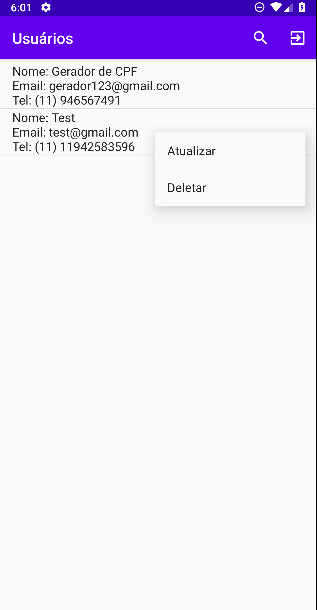

# CrudAndroid
This is an simple Crud app with SQLite.

This app is an app to starters that are still learning how to use the SQLite with Android (like me) and I'll try to leave the code in an easy way to understand. Hope you enjoy it.

## Screens
Here you're going to find some pictures of the screens.

#### Login
Here you're going to do the login or create a new account

#### Register
You can create your account here

OBS:you can use the CPF generator to test the app (https://www.4devs.com.br/gerador_de_cpf)

#### Main Page
Here will be shown all the users data (except for CPF, password and the ID) and you can also update or delete the user.

If you try to delete it's going to appear a message on screen asking if you really want to delete the user.

#### Update page

Here you'll change the data to update the user

